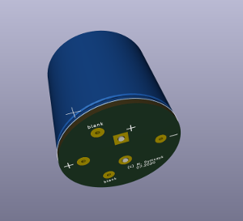
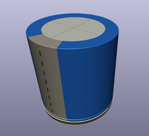
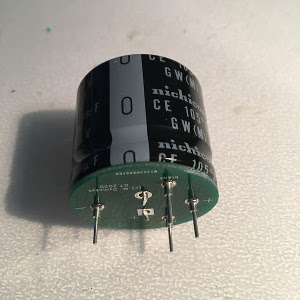
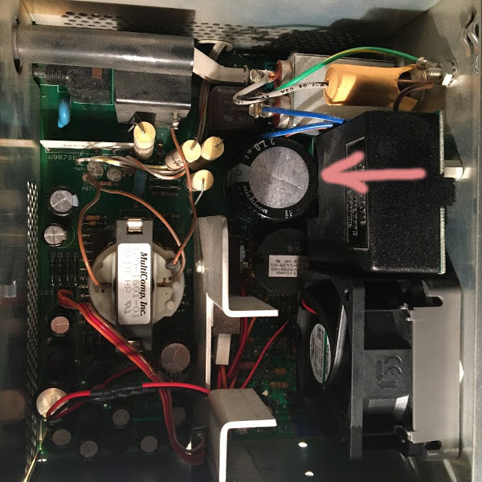

# 4-pin cap adapter for Tektronix 22xx
An adapter for the 4-pin capacitor for Tektronix 22xx (2230, 2232 etc.) series. 4-pin caps are generally hard to come by these days and it's much easier to replace those with a modern Snap-In type.

## What does it fit?

The adapter should fit all 22xx with a switching power supply and a 270uF/450V cap (potentially others too). Definitely Tektronix 2232, 2230, 2245, 2245A, 2246, 2246A, 2247A, 2252.

## What is necessary?

Parts used:
- 1x LGW2W271MELC30 (Digikey: 493-8572-ND) Nichicon 270uF 450V 105*C cap, but others with similar dimensions will fit too
- 4x Harwin H2101-01 (Digikey: 952-1433-ND) pins

With these parts, the cap with an adapter nicely fits under the HV plastic shield and the pins are well aligned with the PCB.

## References

This project is loosely based on the existing project for 7xxx scopes:
https://github.com/peekpt/tekcaps
